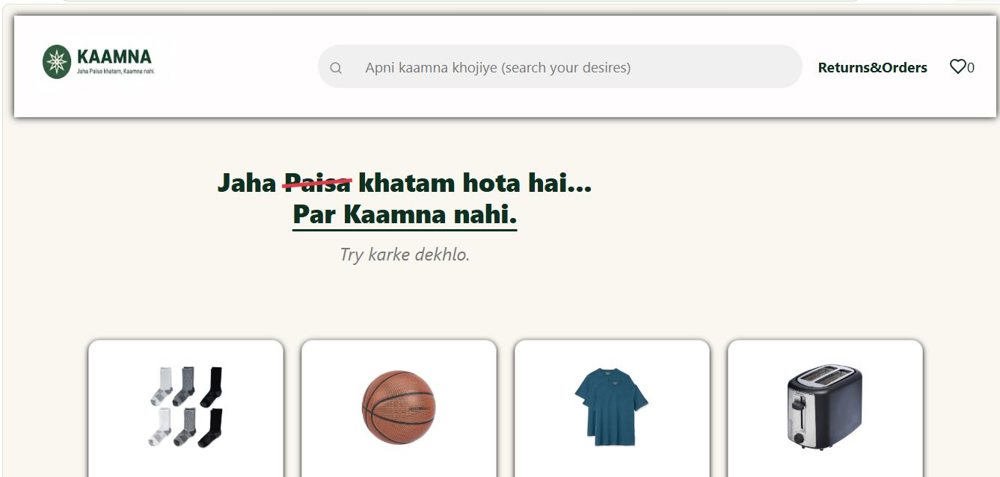
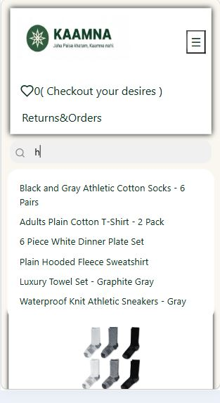
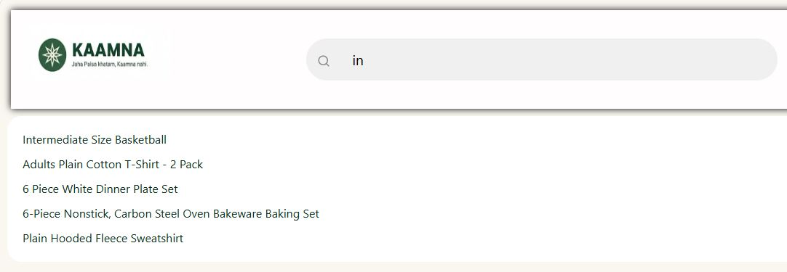
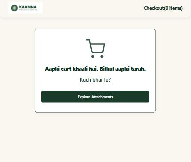
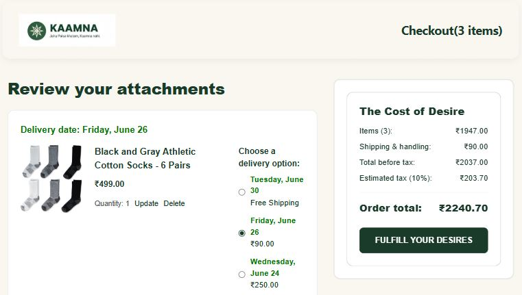
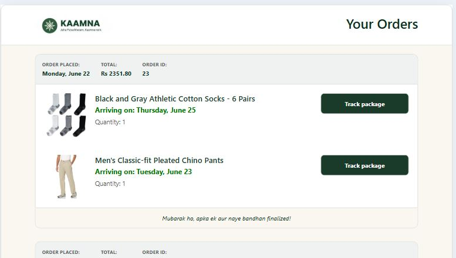
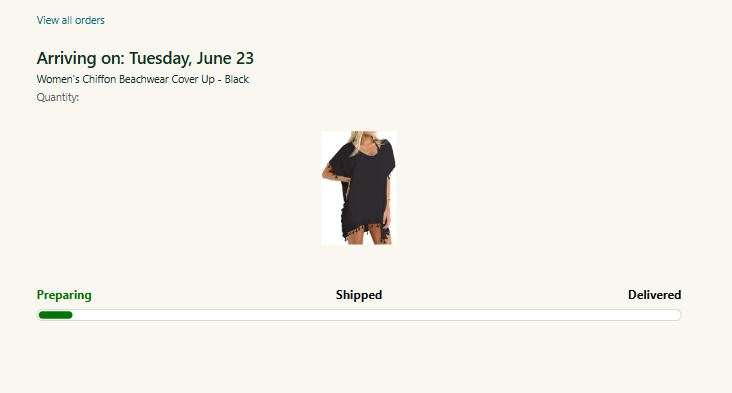

# 🌿 Kaamna — Where Money Ends, Desire Begins

A modern eCommerce application built with **React**, **TypeScript**, **Axios**, and **MockAPI**.

Kaamna is a complete frontend eCommerce experience featuring product browsing, search, cart management, delivery selection, checkout flow, order placement, order history, and package tracking.

This project was originally built using **Vanilla JavaScript** and later fully migrated to **React + TypeScript** to improve scalability, maintainability, and developer experience.

---

## 🚀 Live Demo

🔗 **Live Application**

https://react-ecommerce-project-xi.vercel.app/

Experience the complete Kaamna eCommerce workflow:

* Browse products
* Search products in real-time
* Add items to cart
* Update quantities
* Select delivery options
* Place orders
* View order history
* Track orders

Deployed on Vercel.


---

## 📸 Screenshots

### 🖥 Desktop Experience

The primary shopping experience featuring product discovery, search, cart management, and responsive product cards.



---

### 📱 Mobile Experience

Fully responsive mobile layout with a dedicated navigation experience and mobile-optimized product browsing.



---

### 🔍 Real-Time Product Search

Instant product suggestions while typing, allowing users to quickly discover products.



---

### 🛒 Empty Cart State

Custom-designed empty cart experience encouraging users to continue shopping.



---

### 💳 Checkout Experience

Complete checkout workflow featuring:

- Order summary
- Delivery option selection
- Dynamic shipping costs
- Tax calculations
- Total order computation



---

### 📦 Orders Page

Users can review previous orders, view delivery information, and access order tracking.



---

### 🚚 Order Tracking

Track individual orders with delivery progress visualization and estimated arrival information.



---

## ✨ Features

### 🛍 Product Catalog

- Browse products from backend API
- Responsive product grid
- Product ratings
- Product pricing
- Dynamic rendering using React components

---

### 🔍 Product Search

- Real-time search suggestions
- Case-insensitive matching
- Displays top matching products
- Updates instantly as user types

---

### ❤️ Cart Management

#### Add to Cart

- Add products with selected quantity
- Updates existing cart items automatically
- Prevents duplicate entries

#### Update Quantity

- Quantity validation
- Integer-only values
- Range validation (1–10)

#### Delete Cart Items

- Remove products from cart
- Updates backend and UI instantly

---

### 🚚 Delivery Options

Users can select between multiple delivery options.

Features:

- Delivery date calculation
- Shipping cost display
- Delivery option updates persisted to backend
- Loading states while updating

---

### 💳 Checkout Flow

- Order summary
- Shipping calculations
- Delivery calculations
- Total cost calculation
- Order placement

---

### 📦 Order Management

After placing an order:

- Order gets created in backend
- Cart is cleared
- User is redirected to Orders Page

Orders page displays:

- Order Date
- Order ID
- Ordered Products
- Quantity
- Delivery Information

---

### 🚛 Order Tracking

Track individual orders.

Displays:

- Product Details
- Quantity
- Estimated Arrival Date
- Delivery Progress UI

---

### ⚡ Loading States

Implemented loading states for:

- Initial data fetching
- Delivery option updates
- Quantity updates
- Cart item deletion
- Order placement

---

## 🧠 Technical Concepts Used

### React

- Functional Components
- Props
- Component Composition
- Conditional Rendering
- Lists & Keys
- Controlled Inputs
- State Lifting

### Hooks

- useState
- useEffect
- useRef

### TypeScript

- Interfaces
- Type-safe API calls
- Typed React Props
- Generics
- Utility Types

### API Integration

- Axios
- Async / Await
- Promise.all
- REST APIs

### Routing

- React Router
- Route Parameters
- Query Parameters
- Navigation

### State Management

Shared state architecture:

```txt
App
│
├── HomePage
│   └── Product Cards
│
├── CheckoutPage
│   ├── Cart Summary
│   └── Payment Summary
│
├── OrderPage
│
└── TrackingPage
```

State is lifted to the App component and shared across pages through props.

---

## 🏗 Architecture

```txt
src
│
├── Components
│   ├── HomePage
│   ├── CheckoutPage
│   ├── OrderPage
│   ├── TrackingPage
│   ├── SkeletonLoad
│   └── Shared Components
│
├── Services
│   ├── productApi.ts
│   ├── cartApi.ts
│   ├── orderApi.ts
│   ├── deliveryOptionApi.ts
│   └── deliveryOptionsApi.ts
│
├── Types
│   ├── product.ts
│   ├── cart.ts
│   └── order.ts
│
├── Utility
│   └── formatCurrency.ts
│
├── App.tsx
└── main.tsx
```

---

## 🌐 Backend

The application uses MockAPI for backend services.

### Products

```txt
GET /products
```

### Cart

```txt
GET    /cart
POST   /cart
PUT    /cart/:id
DELETE /cart/:id
```

### Orders

```txt
GET  /orders
POST /orders
```

### Delivery Options

```txt
GET /delivery-options
```

---

## 🔄 Data Flow Example

### Add To Cart

```txt
User Clicks Add To Cart
            ↓
handleAddToCart()
            ↓
Check Existing Item
       ↓           ↓
     Yes           No
       ↓           ↓
Update Qty      Create Item
       ↓           ↓
Update State Locally
       ↓
UI Re-renders
```

---

### Place Order

```txt
User Clicks
"Fulfill Your Desire"
          ↓
Create Order
          ↓
Store In Orders API
          ↓
Delete Cart Items
          ↓
Clear Cart State
          ↓
Navigate To Orders Page
```

---

## 🎯 Challenges Solved

### React Migration

One of the biggest goals of this project was migrating a complete eCommerce application from:

```txt
Vanilla JavaScript
        ↓
React + TypeScript
```

This migration required:

- Component architecture design
- State management redesign
- Event handling refactor
- API integration refactor
- TypeScript adoption

---

### Avoiding Unnecessary API Requests

Instead of refetching the cart after every update:

```txt
POST
↓
GET Cart Again ❌
```

The application updates local state directly:

```txt
POST
↓
Update State Locally ✅
```

This reduces network requests and improves responsiveness.

---

## 📈 What I Learned

Through this project I gained hands-on experience with:

- React Architecture
- TypeScript
- API Integration
- State Management
- Routing
- Async JavaScript
- Component Design
- Frontend Debugging
- CRUD Operations
- Project Structuring

---

## 🛠 Tech Stack

### Frontend

- React
- TypeScript
- CSS3

### Libraries

- Axios
- React Router DOM
- Day.js

### Backend

- MockAPI

### Build Tool

- Vite

---

## 🚀 Installation

Clone the repository:

```bash
git clone https://github.com/yk-09/kaamna-ecommerce.git
```

Move into project:

```bash
cd kaamna-ecommerce
```

Install dependencies:

```bash
npm install
```

Start development server:

```bash
npm run dev
```

Build production version:

```bash
npm run build
```

---

## 👨‍💻 Author

### Yash Kumar

Frontend Developer

- LinkedIn: LinkedIn URL
- GitHub: https://github.com/yk-09

---

## 🌱 Future Improvements

- Authentication
- User Profiles
- Wishlist
- Product Reviews
- Context API / Zustand
- Payment Gateway Integration
- Backend Migration from MockAPI
- Order Status Synchronization
- Admin Dashboard

---

## ⭐ If you like this project

Consider giving the repository a star.

It helps more people discover the project and motivates future improvements.

---

### "Where Money Ends, Desire Begins."

**Kaamna 🌿**